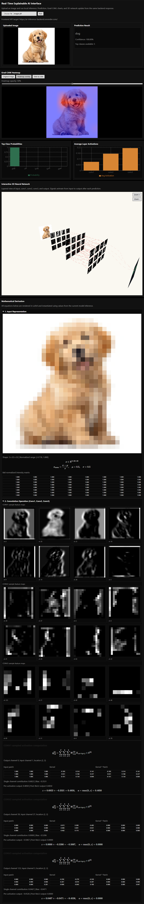

# CNN Feature Map Visualizer

**Understand how AI actually thinks!**

This is an interactive tool that visualizes what happens inside a Convolutional Neural Network (CNN) when it classifies images. See real-time feature maps, activation patterns, and neural network decision-making in action.

---

## Demo



---

## What is This Project?

This project demonstrates the inner workings of a CNN with an interactive visualization dashboard. Upload an image, and watch as the network processes it through multiple layers, showing:

- **Feature Maps**: Visual representations of what each layer is learning
- **Activation Patterns**: Which neurons are firing and why
- **Confidence Scores**: Class probabilities and top predictions
- **Attention Heatmaps**: Where the network focuses to make its decision

This is **NOT** a large language model or a commercial product—it's an educational tool designed to demystify how deep learning models process images and make predictions.

---

## Our Self-Trained Model

- **Architecture**: SimpleCNN (custom PyTorch model)
- **Training Dataset**: CIFAR-10 (50,000 training images + 10,000 test images)
- **Classes**: 10 object categories (airplanes, automobiles, birds, cats, deer, dogs, frogs, horses, ships, trucks)
- **Model Size**: Lightweight and optimized for inference

The model was trained from scratch in Google Colab. You can review the complete training process and experiment with the model in the [Colab Notebook](Colab%20Session/imagerecognisitionmodeltraining.ipynb).

---

## License & Usage

**NOT FOR COMMERCIAL USE**

This repository is strictly for **educational and learning purposes**. Its goal is to help students, researchers, and AI enthusiasts understand:
- How CNNs process and learn from images
- What happens inside neural network layers
- Why the network makes certain predictions
- The importance of feature learning in deep learning

If you find this useful for learning, please credit this project and share your learnings!

---

## Getting Started

### Prerequisites

- Python 3.8+
- Node.js 16+
- Git

### Step 1: Clone the Repository

```bash
git clone https://github.com/adityaverma9777/cnn-featuremap-visualizer.git
cd cnn-featuremap-visualizer
```

### Step 2: Set Up Environment Variables

Create a `.env` file in the root directory by copying the example:

```bash
cp .env.example .env
```

#### For Local Development (Localhost)

Edit your `.env` file with the following values:

```env
# Backend runtime settings
HOST=127.0.0.1
PORT=8000
WORKERS=1

# Allow frontend running on localhost
CORS_ALLOW_ORIGINS=http://127.0.0.1:5173,http://localhost:5173
```

These settings will:
- Run the backend on `http://127.0.0.1:8000`
- Allow the frontend (Vite dev server) to communicate with the backend
- Enable hot-reload during development

### Step 3: Set Up the Backend

```bash
# Create a virtual environment
python -m venv venv

# Activate it
# On Windows:
venv\Scripts\activate
# On macOS/Linux:
source venv/bin/activate

# Install dependencies
pip install -r requirements.txt
```

### Step 4: Run the Backend

```bash
uvicorn app.main:app --host 127.0.0.1 --port 8000 --reload
```

The backend will be available at: `http://127.0.0.1:8000`

### Step 5: Run the Frontend (in a new terminal)

```bash
cd frontend
npm install
npm run dev
```

The frontend will be available at: `http://localhost:5173`

You can now open your browser and start exploring how the CNN thinks!

---

## API Documentation

### Predict Endpoint

`POST /predict`

**Request:**
- Form field: `file` (image upload)

**Image Preprocessing:**
- Resized to `32x32`
- Converted to tensor
- Normalized with mean `0.5` and std `0.5`

**Example Response:**

```json
{
  "prediction": "dog",
  "confidence": 0.87,
  "class_probabilities": [
    { "class": "dog", "probability": 0.87 },
    { "class": "cat", "probability": 0.06 },
    { "class": "bird", "probability": 0.04 }
  ],
  "activations": {
    "conv1": [0.12, 0.04, 0.21, ...],
    "conv2": [0.21, -0.05, 0.18, ...],
    "conv3": [0.08, 0.32, 0.15, ...]
  },
  "heatmap": "iVBORw0KGgoAAAANSUhEUgAA..."
}
```

**Response Fields:**
- `prediction`: Top predicted class
- `confidence`: Confidence score (0-1)
- `class_probabilities`: Softmax scores for all 10 classes
- `activations`: Globally average-pooled values per channel from each convolutional layer
- `heatmap`: Base64-encoded Grad-CAM visualization showing where the network focused

---

## Frontend Visualization

The React frontend displays:

- **Top 5 Class Probabilities**: Bar chart showing all predicted classes
- **Layer Activation Heatmaps**: Visualize what each convolutional layer learned
- **Grad-CAM Attention Map**: Overlay showing which regions influenced the prediction
- **Real-time Stats**: Confidence scores and prediction details

### Frontend Technologies

- React 18
- Vite (lightning-fast dev server)
- Recharts (beautiful data visualizations)

---

## Best Practices: What Images Work Best?

For the best results and to see how the model actually thinks, we recommend:

**Use images with:**
- **White or plain backgrounds** (minimal distractions)
- **Simple, clear subjects** (centered objects)
- **Good lighting** (well-lit, not dark or blurry)
- **Objects from CIFAR-10 categories** (planes, cars, birds, cats, deer, dogs, frogs, horses, ships, trucks)

**Avoid:**
- Images too complex or crowded
- Very dark or low-quality images
- Multiple overlapping objects
- Objects not in the CIFAR-10 classes

Try uploading a simple photo of one of these objects and watch the network's decision-making process!

---

## Deployment Options

### Option 1: Local Development (Recommended for Learning)

Follow the "Getting Started" steps above to run both backend and frontend on your machine.

### Option 2: Cloud Deployment Demo

This repository includes `render.yaml` for deployment to Render:

- **Frontend**: Deployed as static site (fast and free)
- **Backend**: Deployed as Python web service

#### Important Notes About Free Tier:

- **The Vercel/Render deployment is a DEMO only** and meant for testing
- **The backend runs on Render's free tier**, which is slow and has limited resources
- **If the backend takes too long to respond**, it may be sleeping (Render puts free services to sleep after inactivity)
- **To manually wake it up**: Simply visit the backend URL in your browser or refresh the page—it will take 30-60 seconds to start
- **For serious use, clone and run locally**: Local deployment is much faster and recommended

#### To Deploy:

1. Push this repo to GitHub
2. In Render Dashboard: **New +** → **Blueprint**
3. Connect your GitHub repo
4. Render will automatically detect `render.yaml` and provision both services
5. After deployment, update the backend's environment variables:
   - `CORS_ALLOW_ORIGINS=https://<your-frontend>.onrender.com`

---

## Project Structure

```
cnn-featuremap-visualizer/
├── README.md                           # This file
├── requirements.txt                    # Python dependencies
├── render.yaml                         # Render deployment config
├── app/
│   └── main.py                        # FastAPI backend & model inference
├── model/
│   └── final_model.pth                # Trained CNN model weights
├── frontend/
│   ├── src/
│   │   ├── App.jsx                    # Main React component
│   │   ├── ModelReasoning.jsx         # Visualization dashboard
│   │   ├── Network3D.jsx              # 3D network visualization
│   │   ├── styles.css                 # Styling
│   │   └── main.jsx                   # Entry point
│   ├── package.json                   # NPM dependencies
│   ├── vite.config.js                 # Vite configuration
│   └── index.html                     # HTML template
└── Colab Session/
    └── imagerecognisitionmodeltraining.ipynb  # Model training notebook
```

---

## Understanding the Model

This is a **small, custom-trained CNN**—not an LLM (Large Language Model). 

- **Model Type**: Convolutional Neural Network (CNN)
- **Training Method**: Supervised learning on CIFAR-10
- **Size**: Lightweight (under 1MB)
- **Speed**: Real-time inference on CPU
- **Accuracy**: ~85% on test set (trained from scratch)

The model is perfectly suited for learning because it's small enough to understand completely but complex enough to show all the interesting behaviors of deep learning!

---

## Troubleshooting

**Backend not responding?**
- Check that the backend is running on `http://127.0.0.1:8000`
- Ensure `.env` has `CORS_ALLOW_ORIGINS` configured correctly
- Check that port 8000 is not already in use

**Frontend can't reach backend?**
- Verify both are running
- Check browser console for errors
- Ensure `.env` CORS settings match your frontend URL

**Image not being recognized?**
- Try images with cleaner backgrounds
- Ensure the image is one of the 10 CIFAR-10 categories
- Upload a properly sized image (not too large or small)

---

## Learning Resources

Want to dive deeper into how CNNs work?

- [CNN Visualization Techniques](https://arxiv.org/abs/1512.04295) - Grad-CAM paper
- [CIFAR-10 Dataset](https://www.cs.toronto.edu/~kriz/cifar.html)
- [PyTorch CNN Tutorial](https://pytorch.org/tutorials/beginner/blitz/neural_networks_tutorial.html)

---

## Contributing

This is an educational project. If you've learned something interesting or have improvements, feel free to fork and share!

---

## Support

Have questions or found a bug? Open an issue on GitHub!

---

**Happy learning!** Remember: understanding *how* AI works is just as important as using it.
- Frontend service:
  - `VITE_API_BASE_URL=https://<your-backend>.onrender.com`

If you use custom domains, use those domain URLs instead.

### 4. Redeploy

Trigger a redeploy for both services after setting env vars.

### 5. Verify

- Open frontend URL from Render.
- Upload an image and run prediction.
- Confirm requests go to `https://<your-backend>.onrender.com/predict`.

## Config Files for Hosting

- Backend env template: `.env.example`
- Frontend env template: `frontend/.env.example`
- Render blueprint: `render.yaml`
